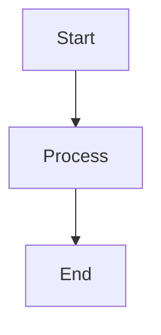

# BJET Odoo Modules Documentation

<div align="center">
  
  
  [](https://bjet.github.io/bjet-documentation/)
  [](https://www.odoo.com)
  [](LICENSE)
  [](https://docusaurus.io)
</div>

## Overview

This repository contains the official documentation for BJET Odoo Modules. Built with Docusaurus 3.6.3, it provides comprehensive guides, API references, and technical documentation for all BJET modules.

### Featured Module

**API Synchronization Module v18.0.1.0.2** - A comprehensive and flexible module that synchronizes Odoo models with external APIs, enabling seamless bidirectional data integration through RESTful interfaces.

## Quick Start

### Prerequisites

- Node.js 18.0 or higher
- npm or yarn package manager

### Installation

```bash
# Clone the repository
git clone https://github.com/bjet/bjet-documentation.git
cd bjet-documentation

# Install dependencies
npm install
```

### Development

```bash
# Start development server
npm start
# Opens at http://localhost:3000

# Start on custom port
npm start -- --port 3001
```

### Build

```bash
# Build static site
npm run build

# Test production build locally
npm run serve
```

## Project Structure

```
bjet-documentation/
├── docs/                    # Documentation content
│   ├── intro.md            # Landing page
│   └── modules/            # Module documentation
│       └── api-sync/       # API Synchronization Module
│           ├── quick-start.mdx
│           ├── configuration/
│           ├── technical-architecture.mdx
│           └── ...
├── src/                    # Source code
│   ├── css/               # Custom styles
│   └── pages/             # Custom pages
├── static/                 # Static assets
│   ├── img/               # Images
│   └── postman/           # Postman collections
├── docusaurus.config.js    # Site configuration
├── sidebars.js            # Sidebar navigation
└── package.json           # Dependencies
```

## Features

- **Dark Mode** - Toggle between light and dark themes
- **Search** - Local search with highlighting
- **Responsive** - Mobile-friendly design
- **Quick Start** - Get running in minutes
- **Technical Docs** - Complete architecture documentation
- **API Reference** - Complete endpoint documentation
- **Code Examples** - Syntax highlighting for multiple languages
- **Multi-Module** - Scalable structure for multiple modules

## Configuration

### Adding a New Module

1. Create directory: `docs/modules/[module-name]/`
2. Add module overview: `docs/modules/[module-name]/index.md`
3. Update `sidebars.js` with new module
4. Add to navbar dropdown in `docusaurus.config.js`

### Customization

- **Colors & Theme**: Edit `src/css/custom.css`
- **Site Config**: Modify `docusaurus.config.js`
- **Navigation**: Update `sidebars.js`

## Writing Documentation

### MDX Support

Create interactive documentation with React components:

```mdx
import Tabs from '@theme/Tabs';
import TabItem from '@theme/TabItem';

<Tabs>
  <TabItem value="python" label="Python">
    ```python
    # Your code here
    ```
  </TabItem>
</Tabs>
```

### Mermaid Diagrams



### Admonitions

```markdown
:::tip[Pro Tip]
Use admonitions to highlight important information
:::

:::warning[Caution]
Important warnings for users
:::
```

## Deployment

The site automatically deploys to GitHub Pages when pushing to the `main` branch via GitHub Actions.

### Manual Deployment

```bash
# Deploy to GitHub Pages
npm run deploy
```

### Environment Variables

```bash
# For GitHub Pages deployment
GIT_USER=<GitHub username>
USE_SSH=true  # If using SSH
```

## Contributing

We welcome contributions! Please follow these steps:

1. Fork the repository
2. Create a feature branch (`git checkout -b feature/amazing-feature`)
3. Commit your changes (`git commit -m 'Add amazing feature'`)
4. Push to the branch (`git push origin feature/amazing-feature`)
5. Open a Pull Request

### Documentation Style Guide

- Use clear, concise language
- Include code examples where applicable
- Add screenshots for UI-related documentation
- Follow the existing structure and formatting
- Test all links and code examples

## License

This documentation is licensed under OPL-1 (Odoo Proprietary License).

## Support

- **Email**: support@bjetpro.com
- **Website**: [https://bjetpro.com](https://bjetpro.com)
- **Documentation**: [https://bjet.github.io/bjet-documentation/](https://bjet.github.io/bjet-documentation/)
- **Issues**: [GitHub Issues](https://github.com/bjet/bjet-documentation/issues)

## Acknowledgments

- Built with [Docusaurus](https://docusaurus.io/)
- Search powered by [@easyops-cn/docusaurus-search-local](https://github.com/easyops-cn/docusaurus-search-local)
- Deployed on [GitHub Pages](https://pages.github.com/)

## Module Versions

| Module | Version | Odoo Version | Status |
|--------|---------|--------------|--------|
| API Synchronization | 18.0.1.0.2 | 18.0 | Stable |

---

<div align="center">
  Copyright © BJET - <a href="https://bjetpro.com">https://bjetpro.com</a>
</div>