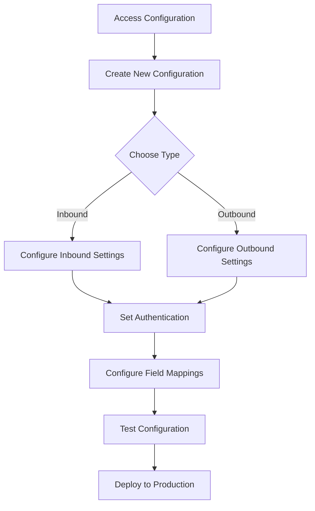

# Quick Start Guide

Get your API synchronization up and running with this step-by-step guide.

## Configuration Flow

## Step 1: Access Configuration

Navigate to **Settings → Technical → BJ API → API Configurations** in your Odoo interface.

*Navigate to Settings → Technical → BJ API → API Configurations*

## Step 2: Create New Configuration

Click the **Create** button to start a new API synchronization configuration.

*The API Configuration creation form*

## Step 3: Choose Configuration Type

Select between **Inbound** (receiving data) or **Outbound** (sending data) synchronization:

### Inbound Configuration

*Select "In" for receiving data from external systems*

- **Purpose**: For inbound data (from an external system to Odoo)
- **Example**: `GET /bj_api_sync/v1/partners`

### Outbound Configuration  

*Select "Out" for sending data to external systems*

- **Purpose**: For outbound data (from Odoo to an external system)
- **Example**: `config._make_outbound_http_request(record, config_id_ref, timeout=60)`

## Step 4: Configure Basic Settings

### General Configuration
1. **Name** – a descriptive name for the configuration
2. **Model** – the Odoo model to be synchronized

*Select target model and filter settings*

### API Settings
3. **Endpoint / URL** – specify the API endpoint or external URL

*Configure API endpoint*

4. **HTTP Methods** – select the allowed HTTP operations

*Select allowed HTTP methods*

5. **Authentication** – configure the required security settings

### Authentication Types

- **No Auth** – no authentication required
- **Basic Auth** – authenticate with login and password
- **Bearer Token** – authenticate with a bearer token

## Step 5: Set Up Field Mappings

Define how Odoo fields correspond to external API data keys in the **Configuration Lines** section:

*Configure field mappings between Odoo and external API*

1. Click **Add a line** in the Configuration Lines section
2. Select the **Field** (Odoo field to be mapped)
3. Enter the **External API Key** (corresponding key in the external API)
4. Mark one field as **Record Identifier** (exactly one per configuration)

### Value Calculation Types

- **Plain** – direct mapping between an Odoo field and the external API key
- **Relational with Mapping Model** – for relational fields (Many2one, One2many, Many2many)
- **Python Script for Plain Value** – calculate the value for a simple field using a Python script
- **Relational with Python Script** – process data for a relational field using a Python script

## Step 6: Test and Deploy

Save the configuration and run sample API requests to verify functionality before deployment.

## Next Steps

- [Detailed Configuration Instructions](configuration/overview)
- [Inbound API Configuration](configuration/inbound-api)
- [Outbound API Configuration](configuration/outbound-api)
- [Troubleshooting](troubleshooting)