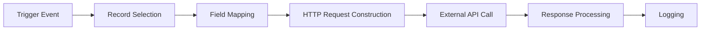

# Technical Architecture

<span className="version-badge">v18.0.1.0.4</span>

## Core Configuration Model

### bj.api.sync.config

Main synchronization configuration that manages:

- **Authentication settings** - Manages authentication credentials and methods
- **HTTP method permissions** - Controls which HTTP methods are allowed
- **Timeout configurations** - Connection and read timeout settings
- **Links to automation triggers** - Connections to cron jobs and base automation

## Field Mapping Models

### bj.api.sync.config.line

Field-to-API key mappings that:

- Support plain value mapping between Odoo fields and API keys
- Handle relational field processing (Many2one, One2many, Many2many)
- Enable Python script transformations for complex data manipulation
- Manage record identification logic with unique identifiers

## Request Configuration Models

### bj.api.sync.header
Custom HTTP headers for API requests with key-value pairs

### bj.api.sync.param
URL parameters for GET requests with operators for filtering

### bj.http.method
Available HTTP methods: GET, POST, PUT, DELETE

## Logging and Monitoring

### bj.api.log

Complete request/response audit trail that:

- Records all HTTP communications
- Tracks error messages and status codes
- Provides debugging information
- Links logs to configuration for traceability

## Controller Architecture

The **BjApiSyncConfigController** manages all inbound API requests through a unified processing pipeline:

1. **Authentication Validation** – verify credentials against the configuration
2. **Method Authorization** – ensure the requested HTTP method is permitted
3. **Configuration Resolution** – locate the appropriate synchronization configuration
4. **Request Processing** – delegate the request to model-specific handlers
5. **Response Generation** – return structured JSON responses
6. **Error Handling** – provide detailed error messages with proper HTTP status codes

## Processing Pipeline

### Inbound Request Flow


**Flow Description:**
HTTP Request → Authentication → Method Check → Configuration Lookup → Data Transformation → Record Processing → Response Generation → Logging

### Outbound Request Flow



**Flow Description:**
Trigger Event → Record Selection → Field Mapping → HTTP Request Construction → External API Call → Response Processing → Logging

## Advanced Configuration Options

### Timeout Management

- **Connection Timeout** – maximum time allowed to establish an API connection (default: 5 seconds)
- **Read Timeout** – maximum time allowed to wait for response data (default: 15 seconds)
- **Configurable per API** – individual timeout settings can be defined for different APIs

### Python Script Context

When using Python scripts for data transformation, the following variables are available:

```python
# Core Odoo objects
env                 # Odoo environment object
model               # Current Odoo model being processed
records             # Recordset being synchronized

# Request data
request_data        # JSON data from external API

# Utility libraries
time, datetime, dateutil, timezone  # Time handling
b64encode, b64decode                # Base64 encoding/decoding
UserError                           # Error exceptions
Command                             # Record manipulation commands
```

### Script Execution Modes

- **Evaluate Mode**: Return computed values for field assignment
- **Execute Mode**: Perform complex operations without return values

## Error Handling and Recovery

### Built-in Error Management

- **Automatic Retry** – retry logic for failed requests
- **Detailed Logging** – error logging with stack traces
- **Graceful Degradation** – handle partial failures without blocking the system
- **Status Code Handling** – responses managed based on HTTP status codes

### Common Error Scenarios

- **401 Unauthorized** – authentication failures
- **405 Method Not Allowed** – unsupported HTTP method
- **404 Not Found** – configuration not found
- **400 Bad Request** – invalid JSON data
- **408 Request Timeout** – connection or response timeout
- **500 Internal Server Error** – server-side error