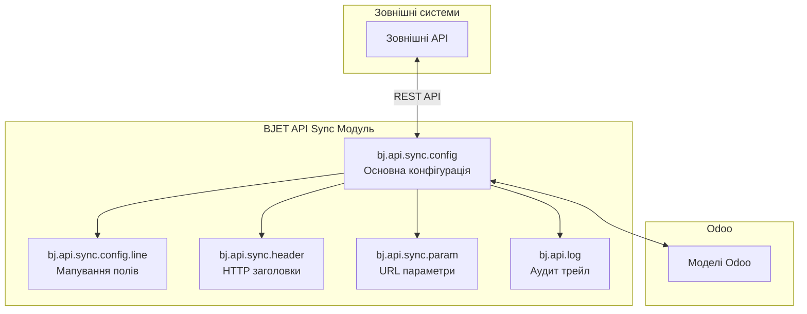

# Модуль API Синхронізації

**Версія:** 18.0.1.0.4  
**Ліцензія:** OPL-1  
**Автор:** BJET  
**Сумісність:** Odoo 18.0

## Огляд модуля

Модуль API Синхронізації - це всебічне рішення, що забезпечує безшовну двонаправлену інтеграцію даних між Odoo та зовнішніми системами через RESTful API. Цей корпоративний модуль пропонує розширені опції конфігурації для практично будь-якого сценарію інтеграції.

## Основні функції

### Двонаправлена синхронізація
- **Вхідна обробка** – Отримання даних із зовнішніх систем до Odoo
- **Вихідна обробка** – Відправка даних Odoo до зовнішніх систем

### Режими інтеграції
- **Інтеграція в реальному часі** – Синхронізація даних миттєво при виникненні змін
- **Заплановані операції** – Автоматична синхронізація через cron завдання

### Підтримка автентифікації
- **Без автентифікації** – Для публічних або внутрішніх API
- **Базова автентифікація** – Доступ за ім'ям користувача та паролем
- **Bearer Token** – Автентифікація за API ключем або токеном
- **Користувацькі заголовки** – Додаткові заголовки автентифікації

### Підтримка протоколу HTTP
- **Повна підтримка REST** – методи GET, POST, PUT та DELETE
- **Користувацькі ендпоінти** – Конфігуровані визначення API ендпоінтів
- **Обробка параметрів** – URL параметри та рядки запитів
- **Управління заголовками** – Конфігурація користувацьких HTTP заголовків

### Трансформація даних
- **Мапування полів** – Візуальне вирівнювання між полями Odoo та ключами API
- **Python скрипти** – Розширені перетворення даних
- **Обчислення значень** – Кілька методів для обчислення значень
- **Реляційні дані** – Підтримка Many2one, One2many, Many2many

### Інтеграція з автоматизацією
- **Cron завдання** – Автоматична синхронізація на основі розкладу
- **Дії сервера** – Ручні тригери через інтерфейс Odoo
- **Базова автоматизація** – Синхронізація на основі подій
- **Конфігурація тригерів** – Гнучкі правила синхронізації

### Моніторинг та відладка
- **Логування запитів** – Повний аудит API комунікацій
- **Відстеження помилок** – Детальні повідомлення про помилки з кодами статусу
- **Налаштування продуктивності** – Конфігуровані таймаути
- **Підтримка відладки** – Всебічні журнали усунення несправностей

import Link from '@docusaurus/Link';

<div style={{textAlign: 'center', margin: '2rem 0'}}>
  <Link
    className="button button--primary button--lg"
    to="/docs/modules/api-sync/quick-start">
    🚀 Посібник швидкого старту
  </Link>
</div>

## Посібник швидкого старту

### Крок 1: Доступ до конфігурації
Перейдіть до **Налаштування > Технічні > BJ API > Конфігурації API**

### Крок 2: Створіть конфігурацію
Натисніть **Створити** та оберіть між:
- **Вхідна** - Отримання даних із зовнішніх систем
- **Вихідна** - Відправка даних до зовнішніх систем

### Крок 3: Налаштуйте автентифікацію
Виберіть метод автентифікації:
- Без автентифікації
- Базова автентифікація (ім'я користувача/пароль)
- Bearer Token (API ключ)

### Крок 4: Налаштуйте мапування полів
Зіставте поля Odoo з ключами зовнішнього API:
- Виберіть поле Odoo
- Введіть відповідний ключ API
- Оберіть тип обчислення значення
- Позначте одне поле як ідентифікатор запису

### Крок 5: Тестування та розгортання
- Збережіть конфігурацію
- Протестуйте на зразках даних
- Моніторте журнали для отримання результатів
- Розгорніть в продакшні

## Архітектура модуля



## Компоненти модуля

| Компонент | Призначення |
|-----------|-------------|
| `bj.api.sync.config` | Основна конфігурація синхронізації |
| `bj.api.sync.config.line` | Мапування поле-до-API ключ |
| `bj.api.sync.header` | Користувацькі HTTP заголовки |
| `bj.api.sync.param` | URL параметри |
| `bj.api.log` | Аудит запитів/відповідей |

## Шаблон API ендпоінту

Для вхідних конфігурацій ендпоінти слідують цьому шаблону:
```
/bj_api_sync/v1/<назва_ендпоінту>
/bj_api_sync/v1/<назва_ендпоінту>/<ідентифікатор_запису>
```

## Розділи документації

📚 **[Посібник з конфігурації](/docs/modules/api-sync/configuration/overview)**  
Покрокові посібники для налаштування вхідних та вихідних API

🐍 **[Python скрипти](/docs/modules/api-sync/python-scripts/context-variables)**  
Довідник для скриптів трансформації даних та доступних змінних контексту

❓ **[Усунення несправностей](/docs/modules/api-sync/troubleshooting)**  
Поширені проблеми, рішення та найкращі практики

📮 **[Колекція Postman](/postman)**  
Завантажити попередньо налаштовану колекцію для тестування API

## Історія версій

| Версія     | Дата випуску | Примітки |
|------------|--------------|----------|
| 18.0.1.0.4 | Поточна | Останній стабільний випуск для Odoo 18.0 |

## Інформація про підтримку

- **Веб-сайт:** [https://bjetpro.com/](https://bjetpro.com/)
- **Електронна пошта підтримки:** [support@bjetpro.com](mailto:support@bjetpro.com)
- **Комерційна підтримка:** Доступна для корпоративних впроваджень
- **Залежності:** `bj_api_log`, `base_automation`

---

<div style={{textAlign: 'center', margin: '3rem 0'}}>
  <Link
    className="button button--primary button--lg"
    to="/docs/modules/api-sync/quick-start"
    style={{marginRight: '1rem'}}>
    🚀 Почати з посібника швидкого старту
  </Link>
  <Link
    className="button button--secondary button--lg"
    to="/docs/modules/api-sync/configuration/overview">
    📚 Переглянути посібник з конфігурації
  </Link>
</div>

---

*Для детальних інструкцій з конфігурації, будь ласка, зверніться до [Посібника з конфігурації](/docs/modules/api-sync/configuration/overview).*