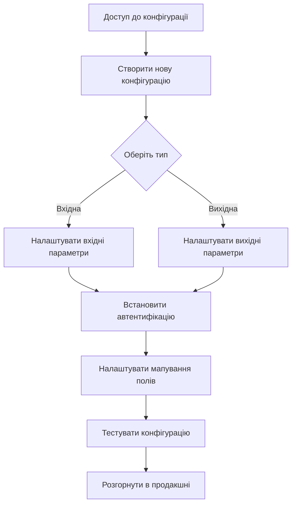

# Посібник швидкого старту

Запустіть синхронізацію API швидко та легко з цим покроковим посібником.

## Схема конфігурації

## Крок 1: Доступ до конфігурації

Перейдіть до **Налаштування → Технічні → BJ API → Конфігурації API** у вашому інтерфейсі Odoo.

*Перейдіть до Налаштування → Технічні → BJ API → Конфігурації API*

## Крок 2: Створити нову конфігурацію

Натисніть кнопку **Створити**, щоб розпочати нову конфігурацію синхронізації API.

*Форма створення конфігурації API*

## Крок 3: Оберіть тип конфігурації

Виберіть між **Вхідною** (отримання даних) або **Вихідною** (відправка даних) синхронізацією:

### Вхідна конфігурація

*Виберіть "Вхідна" для отримання даних із зовнішніх систем*

- **Призначення**: Для вхідних даних (із зовнішньої системи до Odoo)
- **Приклад**: `GET /bj_api_sync/v1/partners`

### Вихідна конфігурація  

*Виберіть "Вихідна" для відправки даних до зовнішніх систем*

- **Призначення**: Для вихідних даних (з Odoo до зовнішньої системи)
- **Приклад**: `config._make_outbound_http_request(record, config_id_ref, timeout=60)`

## Крок 4: Налаштувати основні параметри

### Загальна конфігурація
1. **Назва** – описова назва для конфігурації
2. **Модель** – модель Odoo для синхронізації

*Виберіть цільову модель та налаштування фільтрів*

### Налаштування API
3. **Ендпоінт / URL** – вкажіть ендпоінт API або зовнішній URL

*Налаштуйте ендпоінт API*

4. **HTTP методи** – виберіть дозволені HTTP операції

*Виберіть дозволені HTTP методи*

5. **Автентифікація** – налаштуйте необхідні параметри безпеки

### Типи автентифікації

- **Без автентифікації** – автентифікація не потрібна
- **Базова автентифікація** – автентифікація за логіном і паролем
- **Bearer Token** – автентифікація за bearer токеном

## Крок 5: Налаштувати мапування полів

Визначте, як поля Odoo відповідають ключам даних зовнішнього API в розділі **Рядки конфігурації**:

*Налаштуйте мапування полів між Odoo та зовнішнім API*

1. Натисніть **Додати рядок** у розділі "Рядки конфігурації"
2. Виберіть **Поле** (поле Odoo для мапування)
3. Введіть **Ключ зовнішнього API** (відповідний ключ у зовнішньому API)
4. Позначте одне поле як **Ідентифікатор запису** (рівно один на конфігурацію)

### Типи обчислення значень

- **Звичайний** – пряме мапування між полем Odoo та ключем зовнішнього API
- **Реляційний з моделлю мапування** – для реляційних полів (Many2one, One2many, Many2many)
- **Python скрипт для звичайного значення** – обчислення значення для простого поля за допомогою Python скрипту
- **Реляційний з Python скриптом** – обробка даних для реляційного поля за допомогою Python скрипту

## Крок 6: Тестування та розгортання

Збережіть конфігурацію та виконайте тестові API запити для перевірки функціональності перед розгортанням.

## Наступні кроки

- [Детальні інструкції з конфігурації](configuration/overview)
- [Конфігурація вхідного API](configuration/inbound-api)
- [Конфігурація вихідного API](configuration/outbound-api)
- [Усунення несправностей](troubleshooting)