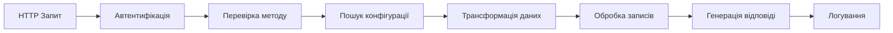
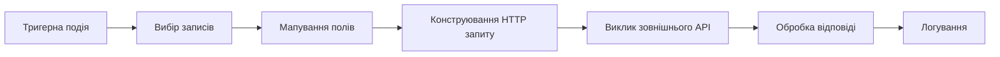

# Технічна архітектура

<span className="version-badge">v18.0.1.0.2</span>

## Основна модель конфігурації

### bj.api.sync.config

Основна конфігурація синхронізації, яка керує:

- **Налаштування автентифікації** - Керує обліковими даними та методами автентифікації
- **Дозволи HTTP методів** - Контролює, які HTTP методи дозволені
- **Конфігурації тайм-ауту** - Налаштування тайм-ауту з'єднання та читання
- **Зв'язки з тригерами автоматизації** - З'єднання з cron завданнями та базовою автоматизацією

## Моделі мапування полів

### bj.api.sync.config.line

Мапування поле-до-API ключа, яке:

- Підтримує пряме мапування значень між полями Odoo та API ключами
- Обробляє реляційні поля (Many2one, One2many, Many2many)
- Дозволяє трансформації Python скриптами для складних маніпуляцій даними
- Керує логікою ідентифікації записів з унікальними ідентифікаторами

## Моделі конфігурації запитів

### bj.api.sync.header
Кастомні HTTP заголовки для API запитів з парами ключ-значення

### bj.api.sync.param
URL параметри для GET запитів з операторами для фільтрування

### bj.http.method
Доступні HTTP методи: GET, POST, PUT, DELETE

## Логування та моніторинг

### bj.api.log

Повний аудит слід запитів/відповідей, який:

- Записує всі HTTP комунікації
- Відстежує повідомлення про помилки та коди статусу
- Надає інформацію для налагодження
- Пов'язує логи з конфігурацією для відстеження

## Архітектура контролера

**BjApiSyncConfigController** керує всіма вхідними API запитами через уніфікований конвеєр обробки:

1. **Валідація автентифікації** – перевірка облікових даних проти конфігурації
2. **Авторизація методу** – забезпечення дозволу запитуваного HTTP методу
3. **Визначення конфігурації** – знаходження відповідної конфігурації синхронізації
4. **Обробка запиту** – делегування запиту обробникам специфічним для моделі
5. **Генерація відповіді** – повернення структурованих JSON відповідей
6. **Обробка помилок** – надання детальних повідомлень про помилки з правильними HTTP кодами статусу

## Конвеєр обробки

### Потік вхідних запитів



**Опис потоку:**
HTTP Запит → Автентифікація → Перевірка методу → Пошук конфігурації → Трансформація даних → Обробка записів → Генерація відповіді → Логування

### Потік вихідних запитів



**Опис потоку:**
Тригерна подія → Вибір записів → Мапування полів → Конструювання HTTP запиту → Виклик зовнішнього API → Обробка відповіді → Логування

## Розширені опції конфігурації

### Управління тайм-аутами

- **Тайм-аут з'єднання** – максимальний час, дозволений для встановлення API з'єднання (за замовчуванням: 5 секунд)
- **Тайм-аут читання** – максимальний час очікування даних відповіді (за замовчуванням: 15 секунд)
- **Налаштовувано для кожного API** – індивідуальні налаштування тайм-ауту можна визначити для різних API

### Контекст Python скрипта

При використанні Python скриптів для трансформації даних доступні наступні змінні:

```python
# Основні об'єкти Odoo
env                 # Об'єкт середовища Odoo
model               # Поточна модель Odoo, що обробляється
records             # Набір записів, що синхронізується

# Дані запиту
request_data        # JSON дані з зовнішнього API

# Утилітні бібліотеки
time, datetime, dateutil, timezone  # Обробка часу
b64encode, b64decode                # Кодування/декодування Base64
UserError                           # Винятки помилок
Command                             # Команди маніпулювання записами
```

### Режими виконання скриптів

- **Режим оцінки**: Повернення обчислених значень для призначення полів
- **Режим виконання**: Виконання складних операцій без повернення значень

## Обробка помилок та відновлення

### Вбудоване управління помилками

- **Автоматичні повтори** – логіка повторів для невдалих запитів
- **Детальне логування** – логування помилок з трасуванням стеку
- **Витончене погіршення** – обробка часткових збоїв без блокування системи
- **Обробка кодів статусу** – відповіді керуються на основі HTTP кодів статусу

### Поширені сценарії помилок

- **401 Неавторизовано** – збої автентифікації
- **405 Метод не дозволений** – непідтримуваний HTTP метод
- **404 Не знайдено** – конфігурацію не знайдено
- **400 Поганий запит** – недійсні JSON дані
- **408 Тайм-аут запиту** – тайм-аут з'єднання або відповіді
- **500 Внутрішня помилка сервера** – помилка на стороні сервера